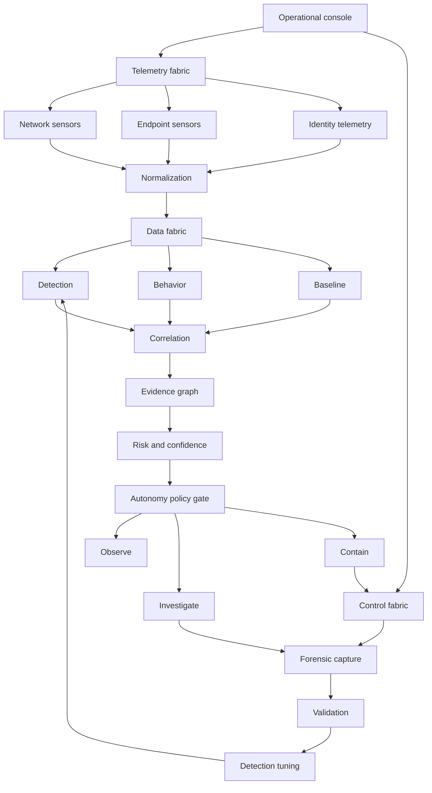

# Ubuntu operations architecture

The operational console keeps its existing black-and-white interface. This increment adds backend ingestion, durable evidence and governed investigation. Presence checks and planned connectors are not working integrations.

| Layer | Implemented behavior | Remaining work |
|---|---|---|
| Telemetry | Zeek JSON and Suricata EVE; five additional local export adapters; existing syslog/agent workers | Remote authenticated sensor transport and real deployment qualification |
| Normalization | Subject, original timestamp, severity, rule, source lineage, bounded attributes and content identity | Complete cross-sensor entity/identity resolution |
| Data | SQLite WAL with evidence/session indexes, retention and decision journal | Campus-scale load testing and external storage |
| Detection/behavior/baseline | Existing workers retained; sensor alerts stay distinct from ordinary observations | Sigma execution and measured detector coverage |
| Correlation/graph | Current-session subject/evidence/origin graph; origin grouping | Neo4j connector and richer identity graph |
| Risk | Explainable bounded severity score and separate confidence heuristic | Calibration using labeled incidents |
| Policy/control | Observe by default; optional snapshot collection for unambiguous online enrolled agents | Validated Linux isolation, control-channel preservation, rollback |
| Forensics | Existing snapshot jobs and bounded dumpcap capture/evidence export | Validated deployment permissions and acquisition guarantees |
| Validation/tuning | Explicit expected subject/origin/rule window matching | Causal exercise validation; approved rule promotion |

## Evidence invariants

- Startup history, previous sessions and records over five minutes old do not enter current decisions. More than 30 seconds of future skew is rejected.
- Partial JSON lines are deferred; oversized lines are discarded; inode changes and truncation restart reading safely.
- Content deduplication survives restart. Repeated alerts from one source do not create independent corroboration.
- Wazuh exports identifying forwarded Suricata/Zeek/Falco alerts keep the underlying origin.
- Tetragon process events and Hubble flow observations do not become alerts merely by existing.
- Derived platform alerts do not count as independent native sensor evidence. Unknown source time prevents automatic investigation.
- Scores are heuristics, not calibrated probabilities.
- Automatic containment remains disabled, including when a legacy environment flag requests it.

## Autonomy

`CAMPUS_OPS_AUTONOMY_MODE=observe` records recommendations only.
`investigate` permits `COLLECT_SNAPSHOT` when fresh, timed alerts meet the configured threshold, pipeline checks pass and the subject maps to exactly one online enrolled endpoint. The durable reservation limits jobs to one per endpoint/session/five-minute bucket. Adjacent buckets may produce jobs less than five minutes apart. Reservation and the existing agent queue are separate transactions; a crash can miss a collection and is not an exactly-once guarantee.

Configurable thresholds are in `config/risk-policy.json`; load them with `CAMPUS_OPS_RISK_POLICY`. Invalid modes/policies fail at startup. Telemetry errors or bus drops block new automatic jobs until addressed and the process restarted.

## Backend APIs

| Route | Purpose |
|---|---|
| GET /api/v1/system/operations-fabric | Runtime, feed counters, policy and recommendations |
| GET /api/v1/system/autonomy | Existing route delegates to the evidence-backed runtime |
| GET /api/v1/system/evidence-graph | Admin-authenticated current-session evidence graph |
| POST /api/v1/admin/validation-runs | Admin-authenticated expected subject, origin, rule and time window |
| GET /api/v1/admin/validation-runs/{run_id} | Temporal match state and supporting evidence IDs |

Validation does not execute attacks or measure ATT&CK coverage. Run handles are in memory (up to 100); starts are journaled locally. No rule is automatically promoted.

See [tool status](TOOL_INTEGRATIONS.md), [Ubuntu deployment](UBUNTU_DEPLOYMENT.md) and [risk register](RISK_REGISTER.md).
